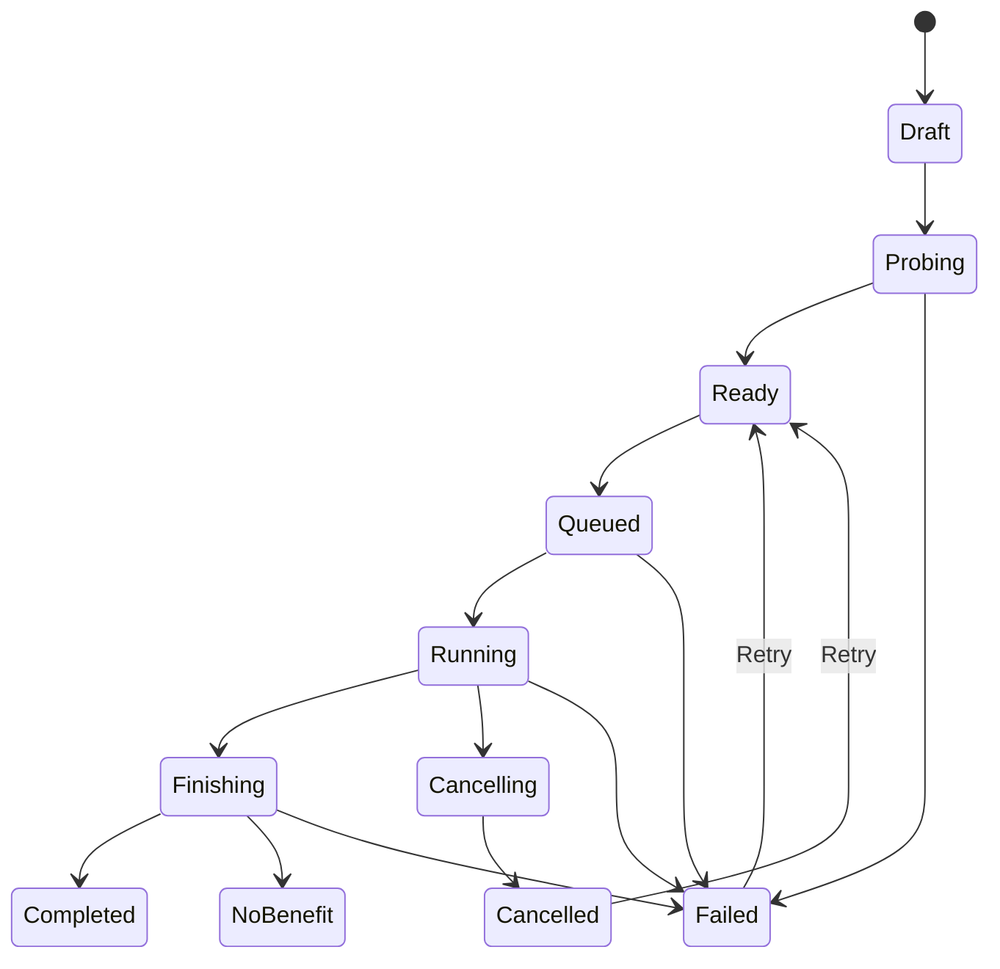

# План разработки нативного macOS-приложения для сжатия видео

Оптимальный путь — не делать «GUI ко всему FFmpeg», а начать с opinionated local-first утилиты: пользователь добавляет видео, приложение само выбирает безопасный баланс размера и качества и создаёт совместимую уменьшенную копию. Архитектуру при этом стоит оставить расширяемой для очереди, новых кодеков, адаптивного анализа и режима целевого размера.

## 1. Рекомендуемые исходные решения

| Решение | Рекомендация для MVP |
|---|---|
| Deployment target | macOS 14+ |
| UI | SwiftUI, `NavigationSplitView`, `Settings` scene |
| Swift | Swift 6 со строгой проверкой concurrency |
| Канал первой публичной beta | Прямая загрузка: Developer ID + notarization |
| Sandbox | Включить с начала разработки |
| FFmpeg | Собственная воспроизводимая сборка, вложенные `ffmpeg` и `ffprobe` |
| Лицензионный профиль | GPL 2.0-or-later, `--enable-gpl` + pinned static `libx264`, без `--enable-version3` и `--enable-nonfree` |
| Видео-вход MVP | H.264 и HEVC в MOV/MP4 с действующей SDR-политикой |
| Видеовыход MVP | H.264 через software libx264 для всех поддерживаемых SDR-источников: совместимый 8-bit 4:2:0 либо 10-bit с исходным chroma 4:2:0/4:2:2/4:4:4 |
| Аудио | AAC |
| Контейнер результата | MP4 + `faststart` |
| Очередь | Последовательная, один FFmpeg-процесс одновременно |
| Данные | Полностью локально, сеть приложению не нужна |
| Архитектура | SwiftUI app target + локальный `CompressionCore` package |
| Intel | Universal 2 для публичной версии; arm64 достаточно для внутреннего прототипа |

Прямая beta через Developer ID обычно позволяет быстрее пройти первые релизы. Для неё нужен Hardened Runtime, подпись и notarization; App Sandbox формально опционален, но я рекомендую оставить его включённым, чтобы позднее не переделывать доступ к файлам. Для Mac App Store sandbox обязателен. [Apple: подготовка приложения к распространению](https://developer.apple.com/documentation/Xcode/preparing-your-app-for-distribution), [Apple: notarization](https://developer.apple.com/documentation/security/notarizing-macos-software-before-distribution).

## 2. Продуктовая структура

Продуктовое обещание:

> Перетащите видео и получите компактную совместимую копию — приложение само выберет параметры. Видео никуда не загружается, оригинал не изменяется.

Основные пользователи:

- Разработчики, QA и support, сжимающие записи экрана для GitHub, Jira или Slack.
- Дизайнеры и маркетологи, которым нужен небольшой MP4 без изучения кодеков.
- Преподаватели и команды, работающие с длинными лекциями и демонстрациями.
- Технические пользователи, знакомые с FFmpeg, но уставшие от CLI.

Принципы:

- Локальная обработка.
- Оригинал всегда неизменяем.
- Нативный selector «Быстрый / Гибкий»: быстрый режим остаётся сценарием по
  умолчанию без обязательных решений, гибкий открывает только ограниченные
  продуктовые настройки.
- Политика построения recipe должна быть типизированной, детерминированной,
  тестируемой и объяснимой, а не набором скрытых произвольных FFmpeg-флагов.
- Не обещать точный размер, фиксированный процент экономии или одинаковое визуальное качество для любого материала.
- Ошибки описываются человеческим языком; stderr доступен только в диагностике.
- FFmpeg-команда не редактируется пользователем вручную.
- Финальный файл появляется только после успешной проверки временного результата.

## 3. Объём MVP

### Первый вертикальный срез

Это первая техническая цель, ещё не полноценный MVP:

1. Выбрать один MOV или MP4.
2. Получить метаданные через bundled `ffprobe`.
3. Запустить один фиксированный H.264/AAC encode.
4. Показать машинно-читаемый прогресс.
5. Поддержать отмену.
6. Записать временный MP4.
7. Проверить результат повторным `ffprobe`.
8. Опубликовать его в финальное имя без замены существующего файла.
9. Показать размер до и после.

Этот срез должен быть готов до создания сложного интерфейса и очереди.

### Публичный MVP

- Импорт через drag-and-drop и `Cmd+O`.
- Один или несколько файлов.
- Официально поддерживаемые входы: MOV и MP4 с H.264 или HEVC-видео
  в рамках действующей SDR-политики и с AAC-аудио либо без аудио.
- Анализ через `ffprobe`:
  - размер;
  - длительность;
  - разрешение;
  - FPS;
  - кодеки;
  - аудиодорожки;
  - rotation;
  - HDR/bit depth.
- Последовательная очередь.
- Два пользовательских режима в нативном segmented selector: «Быстрый» и
  «Гибкий».
- Детерминированный выбор recipe из результатов `ffprobe` и типизированных
  пользовательских настроек по контракту ниже.
- Read-only резюме результата: контейнер, кодек, максимальное разрешение, FPS и аудио.
- Выбор выходной папки.
- Безопасное имя `original-compressed.mp4`.
- Автоматический числовой суффикс при конфликте.
- Прогресс, elapsed time, примерный ETA и скорость вида `1,8×`.
- Отмена и повтор.
- Результат:
  - `1,2 ГБ → 184 МБ`;
  - процент экономии;
  - время обработки;
  - «Открыть»;
  - «Показать в Finder».
- Системное уведомление, если приложение неактивно.
- Экран лицензий и точная версия FFmpeg.

### Контракт режимов сжатия MVP

Этот продуктовый контракт заменяет и прежний обязательный выбор из трёх
пресетов, и последующий вариант только с одним Automatic-режимом. Он не меняет
принятые ограничения кодека, лицензии, sandbox, неизменяемости входа,
временного файла, валидации и безопасной публикации.

После успешного `ffprobe` приложение показывает native segmented selector:

- «Быстрый» — фиксированный сбалансированный recipe без обязательных настроек;
- «Гибкий» — раскрывает качество, максимальное разрешение, предел FPS и звук.

Быстрый режим строит recipe по детерминированным правилам:

- MP4 и `faststart`;
- software H.264 через `libx264`, CRF `22` и preset `medium` для каждого
  поддерживаемого SDR-источника;
- для источника глубиной не более 8 бит — совместимый limited-range `yuv420p`;
- для подтверждённого SDR-источника глубже 8 бит — 10-bit H.264 с сохранением
  поддерживаемого исходного chroma: `yuv420p10le`, `yuv422p10le` или
  `yuv444p10le`;
- при вынужденном уменьшении глубины используется error-diffusion dithering;
- Quick использует фиксированный CRF 22; получающиеся профили High 10,
  High 4:2:2 и High 4:4:4 Predictive для 10-bit материала имеют более узкую
  совместимость с аппаратными декодерами и внешними сервисами, чем 8-bit
  4:2:0 H.264;
- максимум 1920×1080 с сохранением пропорций и без увеличения исходника;
- максимум 30 FPS без повышения более низкой исходной частоты;
- при включённом «Сохранить звук» выбирается default-аудиодорожка с минимальным
  индексом, а при её отсутствии — аудиодорожка с минимальным абсолютным
  индексом;
- выбранная mono-дорожка кодируется в AAC 69 кбит/с; для stereo,
  многоканальной дорожки или неизвестного количества каналов используется AAC
  128 кбит/с; при отсутствии исходного звука результат создаётся без аудио;
- сохранение обычных метаданных в рамках действующей политики выбранных
  потоков;
- все значения представлены закрытыми enum/value types; произвольные флаги
  отсутствуют.

Гибкий режим остаётся закрытой типизированной политикой и допускает только:

- качество `0,30...0,90`, с шагом UI `0,05`;
- максимальное разрешение: исходное, 1920×1080, 1280×720 или 854×480;
- FPS: исходный, максимум 60, максимум 30 или максимум 24;
- сохранить звук по той же channel-aware AAC-политике 69/128 кбит/с либо
  полностью убрать звуковую дорожку.

Гибкий режим использует ту же детерминированную политику bit depth/chroma, что
и быстрый, и всегда создаёт H.264 через libx264. Нормализованное качество
отображается по формуле CompressO
`CRF = 36 - floor(12 × qualityPercent / 100)`, то есть диапазон 30...90%
даёт CRF 33...26. Ручного выбора кодека нет.

`compactRetry` остаётся только явным вторичным действием после Quick-результата
и всегда перекодирует неизменяемый оригинал. Он использует libx264 CRF 31 с
preset `medium`, ту же политику bit depth/chroma, максимум 1280×720 и 24 FPS,
действующий AAC 96 кбит/с при сохранённом звуке и наследует Quick-выбор
keep/remove audio.

Оба режима сохраняют пропорции и никогда не увеличивают разрешение или FPS.
Выбранный recipe фиксируется отдельно для каждого job перед постановкой в FIFO;
последующие изменения UI на queued/running jobs не влияют.
На этапе подготовки проверяется общий video-only capability path, а полный
preflight выбранного immutable recipe выполняется перед encode. Поэтому
неподдерживаемую исходную аудиодорожку всё ещё можно намеренно удалить.

Эти числа являются стартовой продуктовой политикой, а не универсальным
математическим оптимумом. Перед публичным релизом их нужно откалибровать на
репрезентативном корпусе записей экрана, камерного видео, лекций, анимации,
4K и 60 FPS. Изменение откалиброванных значений требует обновления golden
tests и документации поведения.

Если проверенный временный результат не меньше входного файла, приложение не
публикует бесполезную увеличенную копию, удаляет только временный файл этого
job и завершает сценарий нейтральным результатом «Быстрый режим не уменьшил
файл». Это не ошибка кодирования. Точный размер до завершения не
обещается.

### Не включать в MVP

- Гарантированный целевой размер.
- Ручной выбор кодека, контейнера, видео- или аудиобитрейта и metadata policy.
- Пользовательские сохраняемые пресеты и настройки вне ограниченного гибкого
  контракта.
- Пробное кодирование и автоматическая оценка perceptual-качества.
- Пользовательские произвольные FFmpeg-флаги.
- Trim, crop, watermark и другие функции видеоредактора.
- Ручной выбор кодека или контейнера, AV1/VP9-вход и выход.
- Постоянную историю между запусками.
- Pause/resume.
- Облачную обработку и аккаунты.
- Finder extensions и watch folders.
- Полную поддержку HDR/Dolby Vision.
- Сложное управление несколькими аудиодорожками, субтитрами и главами.

### После MVP

Приоритет P1:

- «Уложить в размер» через двухпроходное кодирование.
- Явный пользовательский режим максимальной совместимости H.264 для 10-bit
  источников.
- Выбор аудиодорожек и сохранение субтитров.
- Адаптивный авто-режим: пробное кодирование нескольких репрезентативных
  коротких фрагментов реальным bundled encoder, оценка размера и
  perceptual-качества, затем выбор самого маленького recipe, прошедшего
  откалиброванный порог.
- Персистентная очередь и security-scoped bookmarks.
- Превью исходника и результата.

Добавление VMAF или другой внешней perceptual-метрики требует отдельного
решения по зависимости, лицензии, воспроизводимой FFmpeg-сборке, размеру bundle
и времени анализа. До такого решения `libvmaf` не входит в MVP.

P2:

- Trim и crop.
- Finder Quick Action.
- Папка-наблюдатель.
- Ограничение нагрузки и энергосберегающий режим.
- AV1.

## 4. Экраны

### Главное окно

Рекомендуемая структура:

- Слева — очередь заданий.
- В центре — выбранное видео, метаданные и результат.
- В центре перед запуском — краткое read-only резюме выбранных настроек
  результата и папка назначения.
- В toolbar — добавить, удалить из очереди, запустить, отменить, показать в Finder.

Для самого первого вертикального среза допустим один простой экран без sidebar.

### Пустое состояние

- Drop zone.
- «Выбрать видео…».
- Подпись: «Видео обрабатывается локально. Оригинал не изменится».
- Ссылка на поддерживаемые форматы.

### Готовность к сжатию

- Карточка источника: имя, размер, длительность, разрешение и кодеки.
- Native segmented selector «Быстрый / Гибкий».
- В быстром режиме — read-only резюме и один toggle «Сохранить звук».
- В гибком режиме — native Slider качества, Picker разрешения, Picker FPS и
  toggle звука.
- Краткое резюме, например: `MP4 · H.264 · до 1080p · до 30 FPS · AAC` либо
  `MP4 · H.264 10-bit 4:4:4 · до 1080p · 24 FPS (как в оригинале) · AAC`.
- Если известный исходный FPS не превышает выбранный предел, резюме показывает
  его фактическое значение с пометкой «как в оригинале»; формулировка «до N FPS»
  используется только когда предел уменьшит FPS либо исходная частота неизвестна.
- Папка результата.
- Одна primary-кнопка «Сжать».

Не показывать `CRF`, битрейт видео или произвольные параметры кодировщика:
пользователь управляет нормализованным качеством и продуктовыми ограничениями,
а mapping на libx264 остаётся внутренним типизированным контрактом.

### Выполнение

- Текущий этап: подготовка, кодирование, финализация.
- Прогресс или indeterminate-состояние, если длительность неизвестна.
- ETA только после получения устойчивой скорости.
- Кнопка отмены.
- Ограниченная диагностическая область, а не бесконечный поток stderr.

### Ошибка

Показывать:

- «Не удалось прочитать видео».
- «Недостаточно места в выбранной папке».
- «Выходной диск отключён».
- «Эта версия FFmpeg не содержит нужный кодировщик».

В раскрываемой диагностике:

- версия приложения и FFmpeg;
- exit code;
- последние строки stderr;
- кнопка копирования отчёта.

### Настройки приложения

- Папка результата по умолчанию.
- Политика конфликта имён.
- Уведомления.
- Не давать Mac уснуть во время активной обработки.
- Версия FFmpeg.
- Лицензии.
- RU/EN через String Catalog.

## 5. Модель состояний



Не используйте набор несвязанных `isLoading`, `isRunning`, `isCompleted`. Один `enum JobState` должен быть единственным источником истины.

`NoBenefit` — терминальный успешный исход, а не `Failed`: временный результат
прошёл техническую валидацию, но не оказался меньше входного файла и поэтому
не был опубликован. Пользователь может изменить параметры в гибком режиме и
запустить новое сжатие исходного файла вручную.

Дополнительные состояния импорта:

- `acquiringAccess`;
- `permissionRequired`;
- `fileMissing`;
- `unsupported`;
- `probeFailed`.

## 6. Архитектура

```text
SwiftUI Views
    ↓ user intents / immutable view state
@MainActor CompressionFeatureModel
    ↓
CompressionCoordinator actor
    ├── MediaProbing
    ├── Transcoding
    ├── CommandBuilding
    ├── OutputPlanning
    ├── FileAccessing
    └── JobQueueing
             ↓
Infrastructure
    ├── FFprobeClient
    ├── FFmpegRunner
    ├── ProcessRunner
    ├── ProgressParser
    ├── SecurityScopedFileAccess
    ├── OutputPlanner
    └── DiagnosticLogStore
```

### Domain

Чистые `Sendable`, `Equatable`, при необходимости `Codable`-типы:

- `CompressionJob`;
- `JobState`;
- `MediaInfo`;
- `VideoStreamInfo`;
- `AudioStreamInfo`;
- `CompressionRecipe`;
- `AutomaticCompressionPolicy`;
- `CompressionControlMode` (`quick`, `flexible`);
- `PrimaryCompressionSettings` и `FlexibleCompressionSettings`;
- `RateControl`;
- `ScalePolicy`;
- `FrameRatePolicy`;
- `MetadataPolicy`;
- `OutputPolicy`;
- `TranscodeProgress`;
- `TranscodeFailure`.

Domain не должен импортировать SwiftUI, AppKit или знать о `Foundation.Process`.

### Application

`CompressionCoordinator` как `actor`:

- владеет очередью;
- допускает один активный job;
- проверяет допустимость переходов состояний;
- выполняет `probe → preflight → encode → validate → commit/no-benefit`;
- разрешает гонки между cancel и normal completion;
- публикует immutable snapshots для UI.

### Infrastructure

Протоколы:

```swift
protocol MediaProbing: Sendable
protocol Transcoding: Sendable
protocol ProcessRunning: Sendable
protocol CommandBuilding: Sendable
protocol OutputPlanning: Sendable
protocol FileAccessing: Sendable
```

`Process`, pipes и continuation должны принадлежать отдельному actor. Не передавайте сам `Process` между изоляционными доменами.

### Рекомендуемая структура репозитория

```text
VideoCompressor/
├── AGENTS.md
├── README.md
├── App/
│   ├── Composition/
│   ├── Features/
│   ├── UI/
│   └── Resources/
├── Packages/
│   └── CompressionCore/
│       ├── Sources/
│       │   ├── Domain/
│       │   ├── Application/
│       │   └── Infrastructure/
│       └── Tests/
├── Vendor/
│   └── FFmpeg/
│       ├── bin/
│       ├── licenses/
│       ├── sources/
│       ├── build-config/
│       └── checksums/
├── Tests/
│   ├── Fixtures/
│   ├── ProcessHarness/
│   └── Media/
├── Scripts/
│   ├── build.sh
│   ├── test.sh
│   ├── build-ffmpeg.sh
│   ├── archive.sh
│   ├── notarize.sh
│   └── verify-release.sh
└── docs/
    ├── architecture.md
    ├── testing.md
    ├── RELEASING.md
    └── adr/
```

Не нужны отдельные динамические frameworks: они только усложнят подпись.

## 7. Интеграция FFmpeg

### Запуск

Для MVP используйте CLI-бинарники, а не прямое подключение `libav*`.

Плюсы:

- падение FFmpeg не роняет основной процесс;
- проще обновлять toolchain;
- нет C bridging и ABI-сложности;
- удобнее progress/cancellation;
- проще тестировать command builder.

Production-код получает путь только из app bundle:

```swift
Bundle.main.url(forAuxiliaryExecutable: "ffmpeg")
Bundle.main.url(forAuxiliaryExecutable: "ffprobe")
```

Не искать FFmpeg в Homebrew или `PATH`.

### ffprobe

Использовать JSON:

```text
ffprobe
-v error
-print_format json
-show_format
-show_streams
-show_chapters
INPUT
```

DTO для JSON должен быть отделён от domain-модели. Декодер обязан терпеть отсутствующие и неизвестные поля, строковые числа и rational FPS. [Официальная документация ffprobe](https://ffmpeg.org/ffprobe.html).

### Построение аргументов

Команда хранится только как `[String]`, никогда как одна shell-строка.

Каркас:

```text
-hide_banner
-loglevel warning
-stats_period 0.25
-nostats
-progress pipe:1
-i INPUT
-map 0:v:0
-map 0:a:0?
[ENCODER_ARGS]
-movflags +faststart
-n
TEMP_OUTPUT.mp4
```

Важные правила:

- `Process.executableURL` + `Process.arguments`.
- Никаких `/bin/sh -c`.
- Параметры представлены enum/value types.
- Нет поля «Дополнительные аргументы FFmpeg».
- Поведение нескольких аудиодорожек и субтитров задаётся явно.
- Отсутствие аудио не является ошибкой.
- Для SDR глубиной до 8 бит — совместимый `yuv420p`; для подтверждённого
  >8-bit SDR — 10-bit формат с исходным 4:2:0/4:2:2/4:4:4 chroma; HDR-входы
  нельзя молча конвертировать как обычный SDR.
- Масштабирование обеспечивает чётные размеры.
- Финальный путь никогда не передаётся FFmpeg напрямую.

### Прогресс

Использовать `-progress pipe:1`, а не разбирать человекочитаемый stderr. FFmpeg выдаёт блоки `key=value`, заканчивающиеся `progress=continue` или `progress=end`. [Официальная документация FFmpeg](https://ffmpeg.org/ffmpeg.html).

Основные поля:

- `out_time_us`;
- `frame`;
- `fps`;
- `speed`;
- `total_size`;
- `dup_frames`;
- `drop_frames`.

Расчёт:

```text
fraction = clamp(out_time_us / duration_us, 0...1)
```

Если duration неизвестна — indeterminate progress. UI достаточно обновлять 4–5 раз в секунду.

stdout и stderr нужно дренировать параллельно, иначе заполненный pipe может заблокировать процесс. stderr хранить в ring buffer, например максимум 1–2 МБ.

### Отмена

Рекомендуемая лестница:

1. Перевести job в `cancelling`.
2. Написать `q\n` в stdin FFmpeg.
3. Подождать небольшой grace period.
4. Вызвать `Process.interrupt()`.
5. Затем `Process.terminate()`.
6. `SIGKILL` использовать только как последний fallback.
7. Дождаться EOF обоих pipes.
8. Удалить только временный файл этого job.

Если используется `q`, не передавайте FFmpeg флаг `-nostdin`.

### Безопасное завершение

Успех — это не просто exit code 0:

1. Временный файл существует.
2. Его размер больше нуля.
3. `ffprobe` может его открыть.
4. Присутствует ожидаемый видеопоток.
5. Кодек, контейнер и разрешение соответствуют recipe.
6. Длительность находится в допустимом диапазоне.
7. Только после этого результат атомарно публикуется без замены final-файла.

Имя временного файла должно сохранять расширение:

```text
video.<job-uuid>.partial.mp4
```

Для sandboxed MVP лучше выбирать выходную папку, а не только точный Save URL: доступ к папке позволяет создать временный результат на том же томе и затем атомарно опубликовать проверенную копию без замены существующего файла.

## 8. Sandbox и безопасность

Entitlements приложения:

```text
com.apple.security.app-sandbox = true
com.apple.security.files.user-selected.read-write = true
```

Для вложенных sandboxed CLI-инструментов:

```text
com.apple.security.app-sandbox = true
com.apple.security.inherit = true
```

Apple описывает доступ к выбранным файлам, папкам и security-scoped bookmarks в [документации App Sandbox](https://developer.apple.com/documentation/security/accessing-files-from-the-macos-app-sandbox).

Обязательные меры:

- Держать `startAccessingSecurityScopedResource()` активным до завершения encode, валидации и commit.
- На первом техническом spike проверить, что подписанный дочерний процесс действительно получает нужный доступ.
- Не добавлять network entitlement.
- По возможности отключить ненужные сетевые протоколы в сборке FFmpeg.
- Не разрешать runtime-загрузку или замену FFmpeg.
- Минимизировать environment дочернего процесса.
- Зафиксировать `LC_ALL=C` и `LANG=C`.
- Абсолютные пути в Unified Logging помечать как private.
- Не включать `-report` по умолчанию.
- Не сохранять логи бесконечно.
- Никогда не удалять файлы по широкому glob-паттерну.
- Очищать только temp-файлы, связанные с известными job ID.
- Не перезаписывать источник даже после явного подтверждения пользователя.
- Не показывать неподдерживаемые кодировщики: при старте кэшировать результат `ffmpeg -encoders`.

FFmpeg обрабатывает недоверенные бинарные данные. Отдельный процесс защищает UI от обычного crash, но не заменяет обновление FFmpeg и минимизацию его feature set.

## 9. Сборка и упаковка FFmpeg

### Воспроизводимость

Для каждой версии сохранять:

- FFmpeg release tag или commit;
- checksum исходного архива;
- build script;
- полный configure command;
- patches;
- licenses;
- вывод `ffmpeg -version`;
- вывод `ffmpeg -buildconf`;
- список encoders/decoders.

Собрать одинаковый feature set для `arm64` и `x86_64`, затем:

- объединить через `lipo`, либо
- публиковать архитектурно раздельные artifacts.

Проверить:

```text
file ffmpeg
lipo -info ffmpeg
otool -L ffmpeg
ffmpeg -version
ffmpeg -buildconf
```

Не должно быть ссылок на абсолютные пути Homebrew/MacPorts.

### Включение в bundle

- Добавить FFmpeg через Copy Files.
- Destination: Executables.
- Включить Code Sign On Copy.
- Получать инструменты через `url(forAuxiliaryExecutable:)`.
- Подписывать вложенный код до подписи приложения.

Apple публикует отдельный workflow для [вложения helper tool в sandboxed app](https://developer.apple.com/documentation/xcode/embedding-a-helper-tool-in-a-sandboxed-app).

### Подпись и notarization

Direct distribution:

1. Archive.
2. Подписать nested executables.
3. Подписать app с Developer ID Application.
4. Hardened Runtime и secure timestamp.
5. Упаковать в ZIP/DMG.
6. `xcrun notarytool submit --wait`.
7. `xcrun stapler staple`.
8. Проверить Gatekeeper.

Проверки:

```text
codesign -dvvv --entitlements :- App.app
codesign -dvvv --entitlements :- App.app/Contents/MacOS/ffmpeg
codesign --verify --strict --verbose=2 App.app
spctl -a -vv --type execute App.app
xcrun stapler validate App.app
```

Не используйте `codesign --deep` как способ подписи. Подписывайте вложенный код осознанно изнутри наружу.

## 10. Лицензирование

FFmpeg по умолчанию распространяется под LGPL 2.1+, но выбранный static
`libx264` переводит итоговые `ffmpeg` и `ffprobe` в режим GPL 2.0-or-later.
Resizer также распространяется как GPL-2.0-or-later. [Лицензия
FFmpeg](https://ffmpeg.org/doxygen/trunk/md_LICENSE.html), [FFmpeg legal
checklist](https://ffmpeg.org/legal.html).

Зафиксированный профиль:

- `--enable-gpl`, pinned static `libx264` core 165/r3223, собранный с
  `--bit-depth=all` и `--chroma-format=all`;
- без `--enable-version3`, `--enable-nonfree` и `libx265`;
- весь поддерживаемый SDR output через libx264; HEVC decoder/parser остаются
  для input, а `hevc_videotoolbox` удалён из минимального output-профиля;
- точные FFmpeg/x264 source archives, checksums, licenses, build instructions,
  local patch, configuration/capability reports и version-matched source
  archive рядом с бинарным релизом;
- полный GPLv2 text и явная формулировка «version 2 or later» в проекте и UI.

Запуск FFmpeg отдельным процессом не отменяет обязательства по
распространяемому бинарнику. GPL также не отменяет возможные патентные вопросы
H.264/HEVC; при изменении канала распространения нужна отдельная проверка. Это
не юридическая консультация.

## 11. Тестовая стратегия

| Уровень | Что проверять |
|---|---|
| Unit | State machine, JSON decoding, rational FPS, progress parser, automatic policy, argument builder, naming |
| Process harness | stdout/stderr, большой вывод, exit code, cancel, игнорирование сигналов |
| Integration | `probe → transcode → probe`, temp cleanup, отсутствие encoder |
| UI | Import, drop, start, progress, cancel, retry, reveal in Finder |
| Sandbox | Доступ только после выбора файла/папки, удержание scope |
| Release | Architectures, entitlements, codesign, notarization, Gatekeeper |
| Performance | Память от stderr, responsive UI, несколько длинных заданий |

Process harness — маленький тестовый CLI target, который умеет:

- фрагментированно печатать progress;
- одновременно заполнять stdout и stderr;
- ждать `q`;
- возвращать разные exit codes;
- игнорировать SIGINT;
- завершаться одновременно с cancel.

Это делает тесты runner детерминированными и независимыми от скорости FFmpeg.

Матрица медиа:

- MOV и MP4;
- H.264 и HEVC input;
- 720p, 1080p, 4K;
- запись экрана;
- камерное видео с движением и шумом;
- лекция/говорящая голова;
- UI с мелким текстом и движением курсора;
- portrait + rotation;
- CFR и VFR;
- видео без аудио;
- несколько аудиодорожек;
- subtitles;
- SDR 10-bit с тёмными градиентами;
- HDR;
- повреждённый файл;
- Unicode, emoji, пробелы и shell-символы в имени;
- внутренний и внешний диск;
- read-only folder;
- недостаток места;
- отключение диска;
- cancel в начале, середине и на финализации.

Release gates:

- 100% отсутствие перезаписи или изменения оригинала.
- 100% отмен без orphan-процесса и `.partial`-файла.
- Результаты официального профиля открываются в QuickTime и Quick Look.
- Ошибка одного задания не блокирует очередь.
- UI не зависает во время encode.
- Каждая типизированная политика никогда не увеличивает разрешение или FPS и
  всегда повторяемо строит один и тот же recipe для одинаковых `MediaInfo` и
  пользовательских настроек.
- Временный результат, который не уменьшает входной файл, не публикуется и не
  считается ошибкой.
- Release artifact проходит Gatekeeper на чистой учётной записи.

## 12. Этапы реализации

| Этап | Результат | Definition of Done |
|---|---|---|
| 0. ADR | Зафиксированы target, канал, архитектуры, лицензия и encoder | Нет решения, способного позднее изменить sandbox или bundle |
| 1. Bootstrap | SwiftUI app, tests, scripts, `AGENTS.md` | Debug build и пустой test target проходят |
| 2. Toolchain spike | Bundled FFmpeg запускается внутри sandbox | Реальный probe и encode выбранного файла |
| 3. Архитектура | Domain/Application/Infrastructure/UI | Domain не знает о SwiftUI и `Process` |
| 4. Process runner | Async events, pipes, cancel | Нет deadlock, shell-символы передаются буквально |
| 5. Probe | `ffprobe JSON → MediaInfo` | Fixture tests проходят |
| 6. Compression recipes | Типизированные Quick/Flexible policy и детерминированный argument builder | Golden tests для политик, audio remove и всех ветвей MediaInfo |
| 7. Headless core | `probe → encode → validate → commit/no-benefit` | Один ролик обрабатывается без UI; увеличенный temp не публикуется |
| 8. Single-file UI | Полный пользовательский сценарий | Import, start, cancel, result |
| 9. Queue | FIFO, retry, remove, reorder | Нет duplicate start |
| 10. Hardening | Ошибки, accessibility, localization | Полная матрица зелёная |
| 11. Release | Подписанный artifact | Notarization, Gatekeeper и smoke encode проходят |

Контрольные точки:

- A: sandboxed helper доказан.
- B: headless end-to-end encode.
- C: usable single-file MVP.
- D: feature-complete queue MVP.
- E: notarized release candidate.

## 13. Как работать над этим в Codex

Официальная рекомендация для macOS-разработки в Codex — shell-first цикл через `xcodebuild`, нативные desktop-паттерны и маленькая проверка после каждого изменения. Постоянные правила проекта стоит положить в `AGENTS.md`. [Build for macOS](https://learn.chatgpt.com/use-cases/native-macos-apps), [Prompting](https://learn.chatgpt.com/docs/prompting), [AGENTS.md](https://learn.chatgpt.com/docs/agent-configuration/agents-md).

Одна задача для Codex должна давать один проверяемый результат. Не отправляйте промпт «сделай всё приложение».

Пример `AGENTS.md`:

```markdown
# Project rules

- Build with ./Scripts/build.sh.
- Run ./Scripts/test.sh after behavior changes.
- Preserve uncommitted user changes.
- Do not add third-party dependencies without approval.
- Domain must not import SwiftUI, AppKit, or Foundation.Process.
- Never launch FFmpeg through a shell.
- Treat input files as immutable.
- Write only to unique temporary outputs, validate, then commit.
- Keep stdout and stderr bounded and drained concurrently.
- Do not change signing, entitlements, bundle ID, or deployment target unless requested.
- Report exact verification commands and results.
```

### Общий префикс для промптов

Добавляйте его к каждому этапу:

```text
Ты работаешь в существующем репозитории macOS-приложения [APP_NAME].

Перед изменениями:
1. Прочитай все применимые AGENTS.md.
2. Проверь git status и структуру проекта.
3. Не откатывай и не перезаписывай пользовательские изменения.
4. Найди существующие build/test-команды.
5. Кратко опиши план, затем продолжай без ожидания подтверждения, если нет архитектурно значимой неоднозначности.

Ограничения:
- Работай только в рамках указанного этапа.
- Не добавляй зависимости без необходимости и подтверждения.
- Не меняй bundle ID, deployment target, signing или entitlements без прямого указания.
- Не делай commit, push или release.
- Не переходи к следующему этапу.

После реализации:
- Запусти минимальную релевантную сборку и тесты.
- Сообщи изменённые файлы, точные команды, результаты, риски и ручные проверки.
```

## 14. Готовые промпты для Codex

### Промпт 1 — bootstrap

```text
Цель: подготовить минимальный собираемый каркас нативного macOS-приложения [APP_NAME].

Параметры:
- Bundle ID: [BUNDLE_ID]
- Scheme: [SCHEME]
- Deployment target: macOS 14
- Swift 6
- SwiftUI
- Без сторонних зависимостей

Создай:
- WindowGroup;
- Settings scene;
- минимальный ContentView;
- unit-test target;
- Scripts/build.sh и Scripts/test.sh;
- корневой AGENTS.md;
- README с shell-first build/run workflow;
- docs/adr для продуктовых и технических решений.

Проверь xcodebuild -list, Debug build и пустой test target.

Если репозиторий пуст и невозможно надёжно создать Xcode project доступными инструментами, не генерируй pbxproj вслепую. Дай точные параметры создания пустого macOS App проекта в Xcode и остановись.
```

### Промпт 2 — архитектура

```text
Цель: создать тестируемый архитектурный каркас без запуска FFmpeg.

Добавь Domain-модели:
CompressionJob, JobState, MediaInfo, MediaStream,
CompressionRecipe, AutomaticCompressionPolicy, RateControl,
CompressionControlMode, PrimaryCompressionSettings,
FlexibleCompressionSettings, ScalePolicy, MetadataPolicy, OutputPolicy,
TranscodeProgress.

Добавь протоколы:
MediaProbing, Transcoding, ProcessRunning,
CommandBuilding, OutputPlanning, FileAccessing.

Требования:
- Domain не импортирует SwiftUI/AppKit и не знает о Process.
- UI-модели работают на MainActor.
- Coordinator и долгоживущие конкурентные сервисы допускают actor-реализацию.
- Dependency injection выполняется в composition root.
- Нет global singleton или service locator.
- Для previews и тестов используются fake-сервисы.

Реализуй и протестируй допустимые и недопустимые переходы JobState.
Не реализуй ProcessRunner, FFmpeg и продуктовый UI.
```

### Промпт 3 — FFmpeg toolchain spike

```text
Цель: доказать, что bundled ffmpeg и ffprobe могут работать внутри подписанного sandboxed приложения.

Сначала зафиксируй:
- FFmpeg source tag/commit и checksum;
- configure flags;
- лицензии;
- arm64/x86_64 strategy;
- список включённых encoders, decoders, muxers и protocols.

Для open-source MVP исходи из GPL 2.0-or-later сборки:
- с --enable-gpl и pinned static libx264;
- без --enable-nonfree;
- без libx265;
- с native H.264/HEVC decoder/parser, `libx264` с all-bit-depth/all-chroma
  поддержкой и native AAC.

Добавь ffmpeg/ffprobe в app bundle как Executables с Code Sign On Copy.
Настрой минимальные app/helper entitlements.
Реализуй временную диагностическую кнопку:
выбрать файл → ffprobe → короткий encode в выбранную папку.

Проверь sandbox-доступ, architectures, executable permissions и codesign.
Не создавай финальный UI и очередь.
```

### Промпт 4 — безопасный ProcessRunner

```text
Цель: реализовать общий async ProcessRunner без FFmpeg-специфичной логики.

Типы:
- ProcessRequest: executableURL, arguments, controlled environment;
- ProcessEvent: stdout/stderr chunks или lines;
- ProcessResult: exitCode, terminationReason, bounded diagnostic tail.

Требования:
- Foundation.Process запускается напрямую.
- Запрещены sh -c, bash -c и shell-конкатенация.
- stdout и stderr дренируются одновременно.
- События публикуются через AsyncStream/AsyncThrowingStream.
- Cancellation завершает дочерний процесс.
- Continuation завершается ровно один раз.
- Логи ограничены ring buffer.
- Process не пересекает actor isolation без обёртки.

Создай ProcessHarness CLI и тесты:
success, nonzero exit, simultaneous output, large output,
cancel, ignored signal, Unicode и shell metacharacters.
```

### Промпт 5 — ffprobe

```text
Цель: реализовать FFprobeClient и преобразование JSON в Domain.MediaInfo.

Production-код ищет ffprobe только внутри app bundle.
Для тестов binary URL внедряется через dependency injection.

Используй аргументы, эквивалентные:
-v error -print_format json -show_format -show_streams -show_chapters INPUT

Добавь отдельные DTO и mapping DTO → Domain.

Покрой:
- отсутствующие и неизвестные поля;
- числа как строки;
- rational FPS;
- duration, bitrate и size;
- несколько video/audio/subtitle streams;
- default disposition;
- rotation и color metadata;
- отсутствие video/audio;
- malformed JSON.

Unit-тесты работают на JSON fixtures и не зависят от Homebrew.
```

### Промпт 6 — Quick/Flexible recipes и command builder

```text
Цель: реализовать типизированные Quick/Flexible политики сжатия,
CompressionRecipe и чистый FFmpegCommandBuilder.

MVP:
- MP4;
- libx264 для всех поддерживаемых SDR-источников;
- `yuv420p` для <=8-bit, а для >8-bit — 10-bit H.264 с сохранением
  исходного chroma 4:2:0/4:2:2/4:4:4;
- AAC;
- native selector Quick/Flexible;
- quick recipe: H.264 CRF 22/preset medium, максимум
  1080p/30 FPS, AAC 69 кбит/с для выбранной mono-дорожки и 128 кбит/с для
  остальных или неизвестных channel count, либо удаление audio;
- flexible: quality 0.30...0.90, source/1080p/720p/480p,
  source/60/30/24 FPS, keep/remove audio;
- ни одна политика не увеличивает разрешение или FPS;
- отсутствие audio даёт результат без audio;
- обычные metadata сохраняются в рамках политики выбранных потоков;
- safe output policy.

Builder:
- возвращает [String];
- использует только validated enum/value types;
- явно задаёт stream mapping;
- учитывает отсутствие audio;
- не перезаписывает input или final output;
- пишет только во временный .partial.mp4;
- добавляет machine-readable progress и faststart.

Не добавляй arbitrary FFmpeg flags, ручной выбор codec/container/bitrate,
пробное кодирование или target-size mode.

Добавь golden tests для Quick/Flexible, keep/remove audio,
границ resolution/FPS, Unicode-путей, video без audio, resize и output collision.
```

### Промпт 7 — headless transcoding core

```text
Цель: реализовать TranscodingService поверх ProcessRunning и FFmpegCommandBuilder.

Поведение:
- probe input;
- preflight validation;
- до encode проверить поддержку выбранного безопасного механизма публикации;
- создать уникальный temp output;
- запустить FFmpeg;
- разобрать -progress pipe:1;
- публиковать fraction, processedDuration, speed, fps и outputBytes;
- поддержать graceful cancel через q, затем SIGINT/SIGTERM fallback;
- дождаться завершения process и обоих pipes;
- повторно probe результата;
- проверить stream, codec, resolution и duration;
- сравнить размеры только после успешной технической валидации;
- если temp не меньше input, удалить только этот temp и вернуть типизированный
  нейтральный no-benefit result, не failure;
- только затем опубликовать проверенный temp без замены final URL;
- удалить temp при failure/cancel.

Если cancellation уже зафиксирована, ненулевой exit не превращается в обычную ошибку.

Definition of Done:
короткий fixture проходит probe → transcode → probe без UI; отдельный fixture
доказывает, что увеличенный валидный temp не публикуется.
```

### Промпт 8 — single-file SwiftUI UI

```text
Цель: построить нативный macOS-интерфейс для одного файла.

Состояния:
empty, importing, probing, ready, validationError,
running, cancelling, success, noBenefit, failure.

Добавь:
- drop zone;
- fileImporter и Cmd+O;
- карточку метаданных;
- native segmented selector «Быстрый / Гибкий»;
- quick summary и toggle звука;
- flexible Slider качества, Picker разрешения, Picker FPS и toggle звука;
- выбор output directory;
- одну primary-кнопку Start, а также Cancel, Retry и Reveal in Finder;
- progress, ETA и speed;
- нейтральный no-benefit result, если меньшую копию получить не удалось;
- ограниченную диагностическую панель;
- Settings scene;
- accessibility labels и keyboard navigation;
- fake services для previews.

View не запускает Process напрямую.
Не блокируй main thread.
Не показывай CRF, bitrate, codec/container или произвольные параметры FFmpeg.
Не добавляй очередь нескольких файлов.
```

### Промпт 9 — очередь

```text
Цель: добавить сессионную FIFO-очередь нескольких видео.

Реализуй JobQueueCoordinator как actor.

Семантика:
- concurrency limit = 1;
- add multiple files;
- reorder только waiting queued jobs;
- remove session entry для ready, waiting queued и terminal jobs, но не для
  active/probing/running/finishing/cancelling;
- cancel running или queued job;
- retry failed/cancelled;
- один job нельзя запустить дважды;
- failure не останавливает следующий job;
- закрытие приложения не обещает продолжение encode;
- pause и persistence не входят в этот этап.

Добавь детерминированные тесты через fake Transcoding:
FIFO, cancel, retry, reorder, failure continuation,
concurrent add/cancel и отсутствие duplicate start.
```

### Промпт 10 — hardening и release

```text
Цель: подготовить MVP к прямому распространению через Developer ID.

Сначала проведи read-only аудит:
- architectures app/ffmpeg/ffprobe;
- ffmpeg -version и -buildconf;
- LGPL/GPL/nonfree flags;
- entitlements;
- sandbox file access;
- nested code signing;
- временные файлы и cleanup;
- Process cancellation и pipe handling.

Затем подготовь:
- Scripts/archive.sh;
- Scripts/export.sh;
- Scripts/notarize.sh с Keychain profile;
- Scripts/verify-release.sh;
- docs/RELEASING.md;
- license/source notices;
- release checklist и checksum artifact.

Проверки:
file, lipo -info, otool -L, plutil,
codesign --verify --strict, codesign entitlements,
notarytool submit --wait, stapler validate, spctl assess.

Не сохраняй сертификаты, пароли или notary credentials в репозитории.
Definition of Done: установленный notarized artifact запускает bundled
ffprobe/ffmpeg и успешно сжимает короткий тестовый ролик.
```

### Финальный review-промпт

```text
Проведи read-only review текущего diff и архитектуры приложения.

Приоритеты:
1. shell/command injection;
2. pipe deadlocks и cancellation races;
3. перезапись входа и cleanup temp;
4. sandbox и security-scoped access;
5. неограниченные логи или память;
6. некорректные state transitions;
7. duplicate queue starts;
8. смешение SwiftUI, Domain и FFmpeg infrastructure;
9. architectures, signing, entitlements и licenses.

Для каждого дефекта укажи severity, доказательство,
затронутые файлы и минимальное исправление.
Не вноси изменения до завершения review.
```

Зафиксированные значения: Resizer, `com.example.Resizer`, macOS 14+, Universal
2, Developer ID beta, sandbox, GPL-2.0-or-later и software H.264 через libx264.
Intel slice сохраняется; без отдельно одобренного NASM x264 использует там
более медленный C path с теми же CRF/форматом результата.
